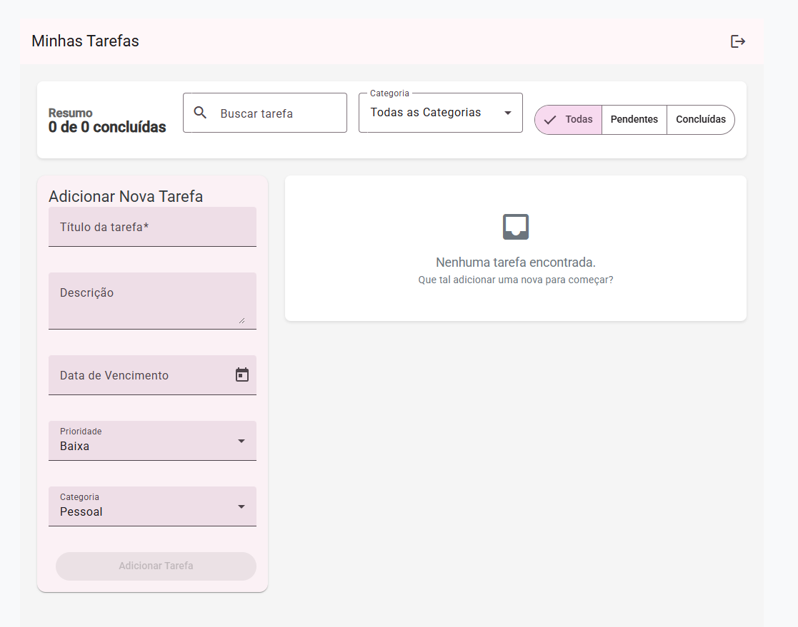

# ToDoList App - Full-Stack

Uma aplicação de lista de tarefas moderna, full-stack, construída com C#/.NET no backend e Angular no frontend.



## 🚀 Visão Geral

Este projeto é uma aplicação completa de To-Do List que permite aos usuários gerenciar suas tarefas diárias. Ele possui um backend robusto para lidar com a lógica de negócios e um frontend reativo e amigável construído com os princípios de design mais recentes.

## ✨ Funcionalidades Principais

A aplicação vai além de um simples CRUD, focando em uma experiência de usuário inteligente e produtiva.

*   **Gerenciamento Completo de Tarefas:** Crie, edite, marque como concluída e exclua tarefas.
*   **Ordenação Inteligente:** As tarefas são automaticamente priorizadas pela data de vencimento e, em seguida, pelo nível de prioridade (Alta, Média, Baixa).
*   **Destaque Visual de Urgência:** Tarefas que vencem hoje ou estão atrasadas são destacadas em vermelho, enquanto as que vencem em breve (7 dias) são destacadas em laranja.
*   **Filtros e Busca:** Filtre tarefas por status (Todas, Pendentes, Concluídas), por categoria, ou encontre-as rapidamente com uma busca por texto.
*   **UX Aprimorada:** Diálogos de confirmação modernos, notificações de feedback e indicadores de carregamento (skeleton loaders) para uma experiência mais suave.
*   **Validação de Dados:** O sistema impede a criação de tarefas com datas de vencimento no passado.

### Demonstrações

| Fluxo Principal (Criar, Editar, Excluir) | Filtros e Busca em Ação |
| :--------------------------------------: | :---------------------------: |
|          |      |

## 🛠️ Tech Stack

**Backend:**
*   C# 12, .NET 8
*   ASP.NET Core Web API
*   Entity Framework Core 8
*   Identity para autenticação
*   Serilog para logging estruturado

**Frontend:**
*   Angular 18
*   TypeScript
*   Angular Material
*   RxJS & Signals
*   Cypress para testes E2E

**Banco de Dados:**
*   PostgreSQL (ou qualquer outro suportado pelo EF Core)

## 🏁 Como Executar o Projeto

Para executar a aplicação, você precisará ter o backend e o frontend rodando simultaneamente.

### Pré-requisitos

*   [.NET 8 SDK](https://dotnet.microsoft.com/download/dotnet/8.0)
*   [Node.js (LTS)](https://nodejs.org/)
*   [Angular CLI](https://angular.io/cli) (`npm install -g @angular/cli`)

### 1. Backend

1.  **Navegue até a pasta da API:**
    ```bash
    cd backend/ToDoList.Api
    ```
2.  **Configure a Conexão com o Banco:**
    *   Ajuste a `DefaultConnection` no arquivo `appsettings.Development.json` para apontar para o seu banco de dados.
3.  **Aplique as Migrações:**
    Este comando criará as tabelas necessárias no seu banco de dados.
    ```bash
    dotnet ef database update
    ```
4.  **Execute a API:**
    ```bash
    dotnet run
    ```
    A API estará rodando em `https://localhost:7149` (ou outra porta, verifique o console).

### 2. Frontend

1.  **Navegue até a pasta da UI:**
    ```bash
    cd frontend/todolist-ui
    ```
2.  **Instale as dependências:**
    ```bash
    npm install
    ```
3.  **Execute a Aplicação:**
    O comando `ng serve` utiliza um proxy (`proxy.conf.json`) para redirecionar as chamadas de API para o backend.
    ```bash
    ng serve
    ```
    A aplicação estará disponível em `http://localhost:4200`.

## 📂 Estrutura do Projeto

Para uma visão detalhada da organização das pastas e da arquitetura, consulte o nosso [Guia de Estrutura do Projeto](docs/01-project-structure.md).

## 🤝 Como Contribuir

Estamos abertos a contribuições! Por favor, leia nossas [Diretrizes de Contribuição](docs/03-git-flow.md) para entender nosso fluxo de trabalho e padrões de código.
